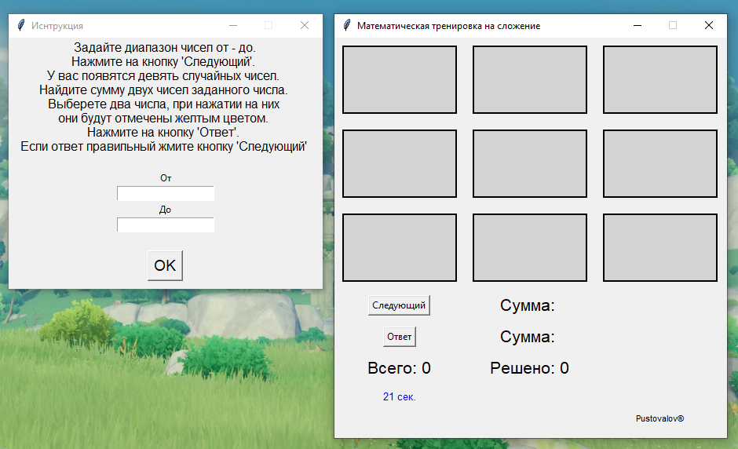

Сборка приложения в .exe файл.

Вариант 1.
Установите - pip install pyinstaller
pyinstaller matic.py -F -n G_matic --icon=icon.ico

Вариант 2.
Установите - pip install cx_Freeze
Запустите сборку .exe - python setup.py build

